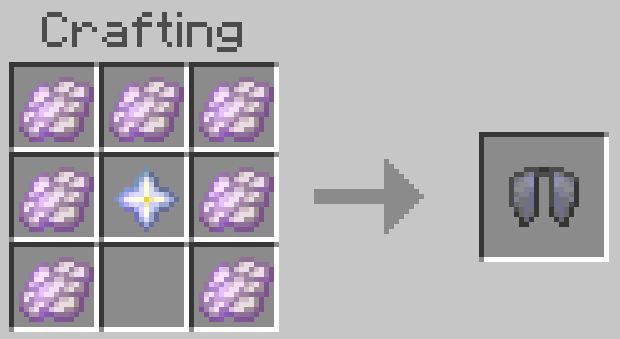
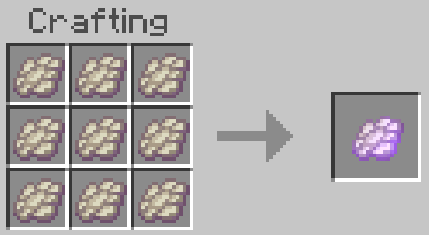

# Craftable Elytra

This is a simple addon for Minecraft Bedrock that makes
[Elytra](https://minecraft.wiki/w/Elytra) renewable, but with expensive
materials.

In vanilla the only way to obtain Elytra is to find them in [End
ships](https://minecraft.wiki/w/End_ship) in the outer islands of [the
End](https://minecraft.wiki/w/The_End). While it's good that Elytra cannot
be easily obtained because they are so powerful, but it isn't good that
they are non-renewable. This is especially problematic in servival
multiplayer worlds (SMP) because the global supply of Elytra quickly
depletes and the End dimension frequently needs resetting, which prevents
players from creating any long-term builds in that dimension.

# Recipes

## Elytra

Elytra can now be crafted with 7 [Reinforced
Membranes](#reinforced-membrane) and 1 [Nether
Star](https://minecraft.wiki/w/Nether_Star). It inherently requires 63
[Phantom Membranes](https://minecraft.wiki/w/Phantom_Membrane) in total,
which makes it no easy to craft but still renewable.

## Reinforced Membrane

A single piece of Reinforced Membrane requires 9 Phantom Membranes to
craft. This item serves no purpose other than to be an intermediate
material for crafting Elytra.

# Installation

1. Enable the behavior pack on your world. It has no resource pack counterpart.
2. And it's done. No experimental settings needs to be enabled.

# Download

See [releases](https://github.com/depressed-pho/craftable-elytra/releases).

# Release notes

See [NEWS](NEWS.md).

# Tested on

* M1 iPad Pro (iOS)

# Author

PHO

# License

[CC0](https://creativecommons.org/share-your-work/public-domain/cc0/)
“No Rights Reserved”
